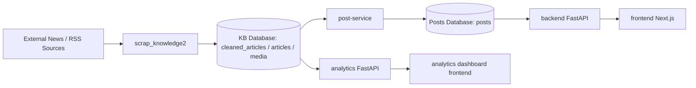
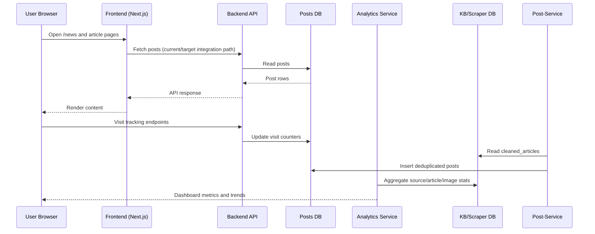

# Pulse Blog App - Overall Architecture

## What This Project Is About
This repository is a multi-service news/blog platform with a scraping-to-publication pipeline:

- A knowledge/scraping pipeline collects and preprocesses external articles.
- A post-ingestion service moves cleaned content into a blog-ready `posts` schema.
- A core backend serves blog APIs, tracks usage analytics, and supports scheduled ingestion from external APIs.
- A Next.js frontend renders public news pages and admin-oriented UI.
- A separate analytics service computes scraper-source metrics and serves dashboard charts.

In short: **this project is an end-to-end content pipeline + publishing UI + analytics stack for a Pulse-style news/blog product.**

## High-Level Component Diagram

## Request and Data Flow

## Service-by-Service Intent
- `scrap_knowledge2`: scrapes and preprocesses source content into PostgreSQL-first KB tables.
- `post-service`: bridge that maps KB records into blog-ready `posts` rows.
- `backend`: primary app API for posts, auth, and visitor analytics; also schedules ingestion.
- `frontend`: user/admin web interface for browsing and editorial views.
- `analytics`: dedicated scraper analytics backend + charting frontend.

## Current Architectural Observations
- There are signs of active migration from mock/static frontend data to live backend data.
- Some backend routes exist as placeholders (`admin`, `external`) and need implementation if required by UI.
- Multiple services interact with similarly named schemas; a clear environment strategy is important to avoid cross-DB confusion.
