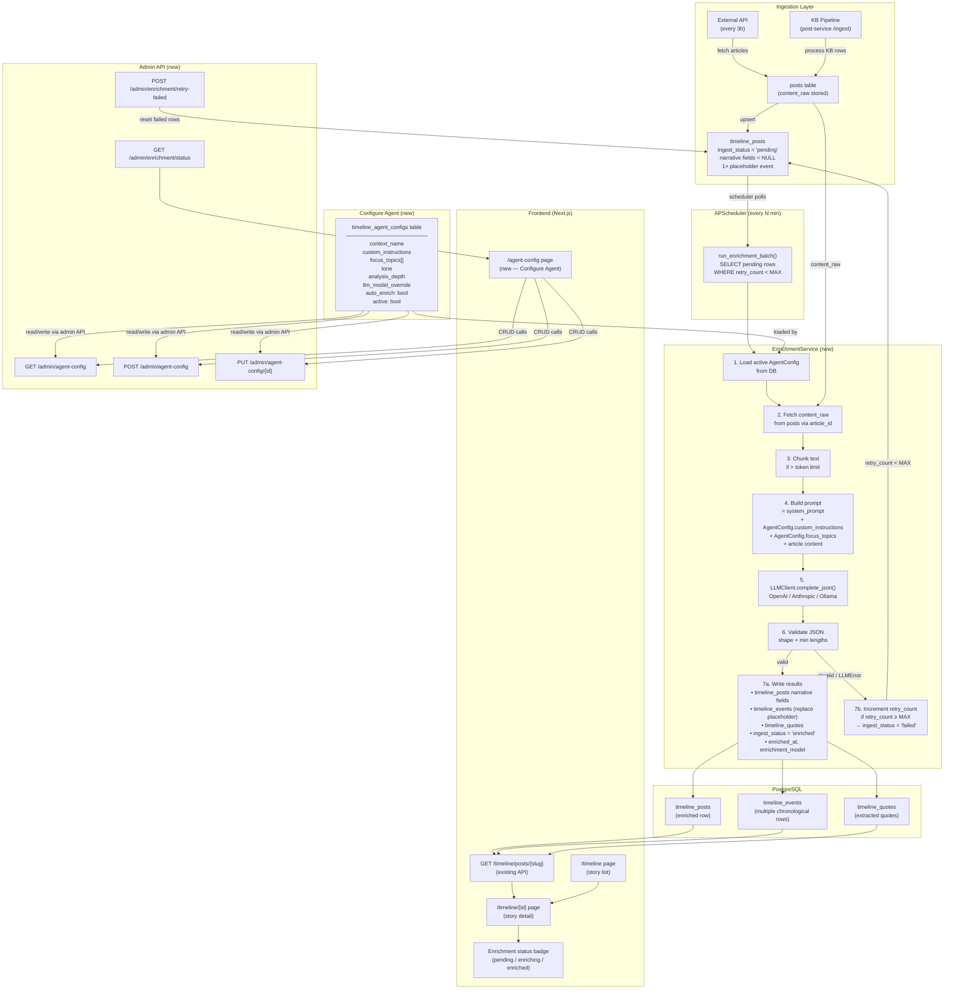

# AI Timeline — Implementation Plan

> **Status:** Requirements & Design  
> **Created:** 2026-04-30  
> **Updated:** 2026-04-30 — Added Configure Agent page + end-to-end workflow diagram  
> **Scope:** End-to-end AI enrichment of ingested posts into structured timeline stories, with user-configurable agent context

---

## 1. Problem Statement

When a post is ingested — either via the scheduled external API fetch or the post-service KB pipeline — a `timeline_posts` row is created with `ingest_status = 'pending'` and **all narrative fields empty** (`background`, `what_happened`, `key_highlights`, `impact`, `whats_next`, `overview`, `impacts_detail`, `quick_take`). The frontend currently renders the hardcoded string `"Analysis coming soon."` for every one of these empty fields.

The goal of this feature is to replace that placeholder with a fully automated, LLM-powered enrichment pipeline that transforms raw ingested article content into structured, readable timeline stories — without any manual editing.

---

## 2. Current State Audit

### 2.1 Post Creation & Ingest Flow (as-built)

```
External API (every 3h)         KB Ingest (post-service /ingest)
        │                                    │
        ▼                                    ▼
backend/services/ingest.py        post-service/app/services/
  → inserts into `posts`            ingest_service.py
                                      → inserts into `posts`
                                      → inserts into `timeline_posts`
                                          (ingest_status = 'pending')
                                      → inserts one `timeline_events` row
                                          (full content, sequence_order=1)
```

The `CreatePostDialog` component in the frontend (`frontend/components/create-post-dialog.tsx`) is a **local-only prototype** — it validates locally with Zod but makes no API calls and is commented out of the header. It is not part of the live post pipeline.

### 2.2 What Ingest Produces Today

| Field | Source | Ingest value |
|---|---|---|
| `title` | KB / external | Populated |
| `short_summary` | KB heuristic | First 500 chars of summary |
| `quick_take` | KB heuristic | First 500 chars of summary (same source) |
| `source_url` | KB | Populated |
| `tags` | KB entity extraction | Populated |
| `focus_area` | KB entities | Populated |
| `primary_image_url` | KB | Populated if available |
| `background` | — | **NULL** |
| `what_happened` | — | **NULL** |
| `key_highlights` | — | **NULL** |
| `impact` | — | **NULL** |
| `whats_next` | — | **NULL** |
| `overview` | — | **NULL** |
| `impacts_detail` | — | **NULL** |
| `ingest_status` | ingest | `'pending'` |
| `timeline_events` | ingest | 1 row: `event_title=title`, `event_content=content[:2000]`, `sequence_order=1` |
| `timeline_quotes` | — | **None** |

### 2.3 What the UI Expects

The detail page (`frontend/app/timeline/[id]/page.tsx`) renders seven named sections mapped directly to DB fields:

| UI Section | DB field | Null fallback |
|---|---|---|
| Quick Take → What Happened? | `what_happened` | `"Analysis coming soon."` |
| Quick Take → Why It Matters? | `impact` | `"Analysis coming soon."` |
| Quick Take → What's Next? | `whats_next` | `"Analysis coming soon."` |
| Article body → Background | `background` | `"Analysis coming soon."` |
| Article body → What Happened? | `what_happened` | `"Analysis coming soon."` |
| Article body → Key Highlights | `key_highlights` (newline-split) | `"Analysis coming soon."` |
| Article body → Impact | `impact` | `"Analysis coming soon."` |
| Article body → What's Next? | `whats_next` | `"Analysis coming soon."` |
| Sidebar → Key Facts | `focus_area`, `overview`, `impacts_detail` | `"—"` |
| Sidebar → Top Quotes | `timeline_quotes` table | Not shown if empty |
| Story Timeline | `timeline_events` table | Not shown if empty |

### 2.4 Mock Seed as the Quality Bar

`docker/postgres/timeline_seed.sql` contains three hand-crafted stories (Iran–Israel, US–China tariffs, India AI policy) with `ingest_status = 'enriched'`. These represent the **expected quality and format** of LLM output. The AI enrichment pipeline must produce output that matches this structure and level of detail.

---

## 3. Feature Goals

1. **Automated narrative generation** — every `pending` timeline post must have all seven narrative fields populated by an LLM without human intervention.
2. **User-configurable agent context** — a Configure Agent page lets the operator define custom instructions, tone, focus topics, and LLM settings that are injected into every enrichment prompt.
3. **Multi-event extraction** — long articles must be broken into multiple chronological `timeline_events` rows (not a single 2000-char dump).
4. **Quote extraction** — notable quotes from the article should populate `timeline_quotes`.
5. **Quality gate** — enriched content must pass a minimum-length/completeness check before `ingest_status` is set to `'enriched'`.
6. **Retry / error resilience** — transient LLM failures must not leave rows permanently broken.
7. **Observability** — the system must log enrichment results and expose a status endpoint.

---

## 4. Architecture

### 4.1 End-to-End Workflow Diagram



---

### 4.2 Component Overview

```
┌─────────────────────────────────────────────────────────┐
│                    Backend (FastAPI)                    │
│                                                         │
│  APScheduler (existing)                                 │
│  ┌──────────────────────────────────────────────────┐  │
│  │  AI Enrichment Job  (new)                        │  │
│  │  • Runs every N minutes                          │  │
│  │  • Queries timeline_posts WHERE ingest_status    │  │
│  │    IN ('pending', 'failed')                      │  │
│  │  • Loads active AgentConfig from DB              │  │
│  │  • For each row → calls EnrichmentService        │  │
│  └──────────────────────────────────────────────────┘  │
│                                                         │
│  EnrichmentService  (new)                               │
│  ┌──────────────────────────────────────────────────┐  │
│  │  1. Load active AgentConfig (custom instructions,│  │
│  │     tone, focus topics, model override)          │  │
│  │  2. Load raw content from posts table            │  │
│  │  3. Chunk if content > token limit               │  │
│  │  4. Build prompt (system + agent context +       │  │
│  │     article)                                     │  │
│  │  5. Call LLM with structured prompt              │  │
│  │  6. Parse + validate JSON response               │  │
│  │  7. Write narrative fields to timeline_posts     │  │
│  │  8. Write events to timeline_events              │  │
│  │  9. Write quotes to timeline_quotes              │  │
│  │  10. Set ingest_status = 'enriched' | 'failed'   │  │
│  └──────────────────────────────────────────────────┘  │
│                                                         │
│  LLM Client  (new)                                      │
│  ┌──────────────────────────────────────────────────┐  │
│  │  Abstraction over OpenAI / Anthropic / Ollama    │  │
│  │  • Structured output (JSON mode)                 │  │
│  │  • Retry with exponential backoff                │  │
│  │  • Token counting + truncation                   │  │
│  └──────────────────────────────────────────────────┘  │
└─────────────────────────────────────────────────────────┘

┌─────────────────────────────────────────────────────────┐
│                   Frontend (Next.js)                    │
│                                                         │
│  /timeline/[id]  (existing)                             │
│  • No changes required for happy path                   │
│  • Enhancement: show enrichment-in-progress skeleton    │
│    when ingest_status = 'pending'                       │
│                                                         │
│  /agent-config  (NEW)                                   │
│  • Configure Agent page — see Section 8                 │
└─────────────────────────────────────────────────────────┘
```

### 4.3 Data Flow (Narrative)

```
1. ingest_service.py  →  timeline_posts row  (ingest_status = 'pending')
2. AI Enrichment Job picks up the pending row
3. Loads the active AgentConfig from timeline_agent_configs
4. Fetches content_raw from `posts` table (via article_id join)
5. Chunks text if needed
6. Builds prompt = base system prompt + AgentConfig.custom_instructions
                 + AgentConfig.focus_topics + article content
7. Calls LLM → structured JSON
8. Writes:
   - timeline_posts: background, what_happened, key_highlights,
                     impact, whats_next, overview, impacts_detail,
                     quick_take, is_ai_policy, ingest_status='enriched'
   - timeline_events: multiple rows (chunked events), replaces the
                      single raw-content row
   - timeline_quotes: extracted quotes with attribution
9. Frontend reads enriched data via existing GET /timeline/posts/{slug}
```

### 4.4 `ingest_status` State Machine

```
           ingest
pending ──────────────► enriching ──── success ──► enriched
   ▲                        │
   │                   LLM failure
   │                        │
   └────── retry_count < 3 ─┘
                        │
                   retry_count ≥ 3
                        │
                        ▼
                      failed
                        │
               POST /admin/enrichment/
                    retry-failed
                        │
                        ▼
                     pending  (reset)
```

New `ingest_status` values required: `'enriching'`, `'failed'`  
New column required: `retry_count: int DEFAULT 0`

---

## 5. Database Changes

### 5.1 `timeline_posts` — new columns

```sql
ALTER TABLE timeline_posts
  ADD COLUMN IF NOT EXISTS retry_count       SMALLINT NOT NULL DEFAULT 0,
  ADD COLUMN IF NOT EXISTS enriched_at       TIMESTAMPTZ,
  ADD COLUMN IF NOT EXISTS enrichment_model  VARCHAR(100),
  ADD COLUMN IF NOT EXISTS agent_config_id   INTEGER REFERENCES timeline_agent_configs(id);
```

- `retry_count` — how many enrichment attempts have failed
- `enriched_at` — timestamp when `ingest_status` was set to `'enriched'`
- `enrichment_model` — which LLM model produced the enrichment (for auditability)
- `agent_config_id` — FK to the agent config used for this enrichment (nullable; null = default config at time of run)

### 5.2 `timeline_agent_configs` — new table

```sql
CREATE TABLE timeline_agent_configs (
    id                  SERIAL PRIMARY KEY,
    context_name        VARCHAR(100) NOT NULL,           -- display name, e.g. "Geopolitics Analyst"
    custom_instructions TEXT,                            -- injected after system prompt
    focus_topics        TEXT[],                          -- e.g. {"sanctions","trade war","diplomacy"}
    tone                VARCHAR(30)  DEFAULT 'neutral',  -- "neutral" | "analytical" | "simplified"
    analysis_depth      VARCHAR(20)  DEFAULT 'standard', -- "brief" | "standard" | "deep"
    llm_model_override  VARCHAR(100),                    -- overrides global LLM_MODEL if set
    auto_enrich         BOOLEAN NOT NULL DEFAULT TRUE,   -- if false, job skips pending rows
    active              BOOLEAN NOT NULL DEFAULT TRUE,   -- only one config should be active at a time
    created_at          TIMESTAMPTZ DEFAULT NOW(),
    updated_at          TIMESTAMPTZ DEFAULT NOW()
);
```

**Business rules:**
- Only one config with `active = TRUE` is used by the enrichment job at any time
- If no config is active, the job falls back to the global `LLM_MODEL` and the default system prompt with no custom instructions
- `context_name` is shown in the frontend Configure Agent page header
- `llm_model_override` is useful to switch to a more powerful model (e.g., `gpt-4o`) for important topics while keeping `gpt-4o-mini` as the global default

**How `custom_instructions` and `focus_topics` are used in the prompt:**

```
[system]
You are a world-class news analyst...
{custom_instructions}  ← injected here verbatim

[user]
Focus areas to emphasize: {focus_topics joined by ", "}
Tone: {tone}
Analysis depth: {analysis_depth}

Article title: ...
Article content: ...
```

### 5.3 `timeline_events` — existing columns are sufficient

The ingest currently inserts one row with `sequence_order = 1`. After enrichment, this row will be **replaced** with multiple chronological event rows extracted by the LLM.

### 5.4 `timeline_quotes` — existing columns are sufficient

Enrichment will insert new rows here. No schema changes needed.

### 5.5 Alembic Migrations

| Migration | Contents |
|---|---|
| `0003_ai_timeline_agent_config.py` | Create `timeline_agent_configs` table |
| `0004_ai_timeline_enrichment_columns.py` | Add `retry_count`, `enriched_at`, `enrichment_model`, `agent_config_id` to `timeline_posts`; update `ingest_status` check constraint |

---

## 6. LLM Prompt Design

### 6.1 System Prompt (with Agent Context injection)

The final system prompt is assembled at enrichment time by combining the base prompt with the active `AgentConfig`:

```
You are a world-class news analyst. Given a raw article, you will extract and generate 
structured analysis following a strict JSON schema. Your analysis should be factual 
and written for a general but informed audience.

{AgentConfig.custom_instructions}
```

If `custom_instructions` is empty, the placeholder is omitted. Example with a filled config:

```
You are a world-class news analyst...

Additional context: This blog focuses on geopolitical risks for institutional investors.
Emphasize macro-economic consequences. Avoid speculative language. When discussing
government policy, note enforcement mechanisms where mentioned.
```

### 6.2 User Message (with Agent Context injection)

```
Focus topics (pay special attention to these): sanctions, trade policy, diplomacy
Tone: analytical
Analysis depth: deep

Article title: {title}
Article content:
{content_truncated}

Respond ONLY with a valid JSON object matching the schema below. No preamble, no explanation.
{json_schema}
```

### 6.2 Output JSON Schema

The LLM must return a single valid JSON object matching:

```json
{
  "quick_take": "string (1–2 sentences, most essential point)",
  "background": "string (2–4 sentences, historical/contextual setup)",
  "what_happened": "string (2–4 sentences, the specific events covered in this article)",
  "key_highlights": ["string", "string", "..."],
  "impact": "string (2–3 sentences, why this matters short-term and long-term)",
  "whats_next": "string (2–3 sentences, expected next steps or uncertainties)",
  "overview": "string (1 sentence, factual one-liner for the key facts sidebar)",
  "impacts_detail": "string (1–2 sentences, implementation or enforcement detail)",
  "is_ai_policy": true | false,
  "events": [
    {
      "event_time": "ISO 8601 date string or null",
      "event_title": "string (short headline for this moment)",
      "event_content": "string (1–3 sentences describing this moment)",
      "sequence_order": 1
    }
  ],
  "quotes": [
    {
      "quote_text": "string (verbatim or near-verbatim from article)",
      "attributed_to": "string (person name and title if available)",
      "display_order": 1
    }
  ]
}
```

**Rules encoded in the prompt:**
- `key_highlights` must be an array of 3–6 strings, each under 100 characters
- `events` must have at least 1 and at most 8 entries, ordered chronologically
- `quotes` may be an empty array if no direct quotes exist in the article
- All string fields must be non-empty if present; omit the key only if truly not applicable
- Dates must use the article's own dates, not inference

### 6.3 Token Budget

| Component | Approx tokens |
|---|---|
| System prompt | ~100 |
| Article content (input) | up to 6,000 |
| Output JSON | ~800 |
| Safety buffer | 200 |
| **Total** | **~7,100** |

For articles exceeding 6,000 tokens, the content will be truncated at the last full sentence within the limit. Future enhancement: map-reduce summarization for very long articles.

---

## 7. Backend Implementation Plan

### Phase 0 — Configuration

**File: `backend/core/config.py`**

Add new settings:
```python
LLM_PROVIDER: str = "gemini"             # "gemini" (primary); future: "openai" | "anthropic"
LLM_MODEL: str = "gemini-2.0-flash"      # Gemini model slug
GEMINI_API_KEY: str = ""                  # from env — Google AI Studio key
ENRICHMENT_INTERVAL_MINUTES: int = 5      # how often to poll for pending rows
ENRICHMENT_BATCH_SIZE: int = 5            # rows to process per job run
ENRICHMENT_MAX_RETRIES: int = 3           # before marking 'failed'
ENRICHMENT_MAX_INPUT_TOKENS: int = 6000   # chars, not tokens (Gemini uses char budget)
```

**File: `backend/.env`**

```
LLM_PROVIDER=gemini
LLM_MODEL=gemini-2.0-flash
GEMINI_API_KEY=AIza...
```

**Gemini model options (choose one):**

| Model | Speed | Quality | Cost |
|---|---|---|---|
| `gemini-2.0-flash` | Fastest | Good | Very low — recommended default |
| `gemini-1.5-flash` | Fast | Good | Low |
| `gemini-1.5-pro` | Slower | Best | Higher — use for deep analysis depth |
| `gemini-2.0-flash-thinking` | Slow | Best + reasoning | Higher |

---

### Phase 1 — Alembic Migration

**New file: `backend/alembic/versions/0003_ai_timeline_enrichment_columns.py`**

Adds `retry_count`, `enriched_at`, `enrichment_model` to `timeline_posts`.  
Updates `ingest_status` check constraint to allow `'enriching'` and `'failed'`.

---

### Phase 2 — LLM Client (Gemini)

**New file: `backend/services/llm_client.py`**

```python
import google.generativeai as genai
import json

class LLMClient:
    """
    Gemini-backed LLM wrapper with structured JSON output.
    Provider abstraction retained so OpenAI/Anthropic can be added later.
    """
    def __init__(self, provider: str, model: str, api_key: str):
        if provider == "gemini":
            genai.configure(api_key=api_key)
            self._model = genai.GenerativeModel(
                model_name=model,
                generation_config=genai.types.GenerationConfig(
                    response_mime_type="application/json",
                    temperature=0.2,       # low = more deterministic/factual
                    max_output_tokens=2048,
                ),
            )
        else:
            raise ValueError(f"Unsupported provider: {provider}")
        self.provider = provider

    async def complete_json(self, system: str, user: str) -> dict:
        """
        Call Gemini and return parsed JSON dict.
        Raises LLMError on all failure modes.
        """
        prompt = f"{system}\n\n{user}"
        response = await asyncio.to_thread(self._model.generate_content, prompt)
        text = response.text.strip()
        try:
            return json.loads(text)
        except json.JSONDecodeError as e:
            raise LLMParseError(f"JSON parse failed: {e}\nRaw: {text[:500]}")
```

**Python package required:**

```
google-generativeai>=0.8.0
```

Add to `backend/requirements.txt`.

**Key Gemini behaviours to handle:**

| Behaviour | Handling |
|---|---|
| `response_mime_type="application/json"` | Forces Gemini to output raw JSON — no markdown fences, no preamble |
| Safety filters block the response | Catch `response.prompt_feedback` and raise `LLMContentError`; increment retry_count |
| Rate limit (429) | `google.api_core.exceptions.ResourceExhausted` → exponential backoff, max 3 retries |
| Empty / truncated response | Check `response.candidates[0].finish_reason`; if not `STOP`, treat as failure |
| Token counting | Use `model.count_tokens(prompt)` before calling to ensure input fits; Gemini-2.0-flash supports 1M token context |

---

### Phase 3 — Enrichment Service

**New file: `backend/services/enrichment_service.py`**

```python
class EnrichmentService:
    def __init__(self, db: Session, llm: LLMClient): ...

    async def enrich_post(self, post: TimelinePost) -> bool:
        """
        Fetch raw content, call LLM, write results.
        Returns True on success, False on failure.
        """
        ...

    def _get_raw_content(self, post: TimelinePost) -> str:
        """
        Join timeline_post → posts via article_id to get full content.
        Falls back to content already in timeline_events if posts row not found.
        """
        ...

    def _build_prompt(self, title: str, content: str) -> str:
        """Assemble user message with article title + truncated content."""
        ...

    def _validate_output(self, data: dict) -> bool:
        """
        Check required keys, string lengths, list sizes.
        Returns False if output is malformed.
        """
        ...

    def _write_results(self, post_id: int, article_id: str, data: dict):
        """
        Upsert narrative fields on timeline_posts.
        Delete-then-insert timeline_events (replace placeholder row).
        Insert timeline_quotes.
        """
        ...
```

**Retry logic:**
- On `LLMError`, increment `retry_count`, set `ingest_status = 'pending'`
- If `retry_count >= MAX_RETRIES`, set `ingest_status = 'failed'`
- On validation failure (bad JSON shape), treat same as `LLMError`

---

### Phase 4 — Scheduler Job

**File: `backend/main.py`** (modify)

Add to the existing APScheduler setup:

```python
from services.enrichment_service import run_enrichment_batch

scheduler.add_job(
    run_enrichment_batch,
    "interval",
    minutes=settings.ENRICHMENT_INTERVAL_MINUTES,
    id="ai_enrichment",
)
```

**New function `run_enrichment_batch` in `enrichment_service.py`:**

```python
async def run_enrichment_batch():
    """
    Polls for up to ENRICHMENT_BATCH_SIZE rows where
    ingest_status IN ('pending', 'failed') AND retry_count < MAX_RETRIES.
    Processes each through EnrichmentService.
    """
    ...
```

---

### Phase 5 — Admin / Status Endpoint

**File: `backend/routers/admin.py`** (extend)

```
GET /admin/enrichment/status
```

Returns:
```json
{
  "pending": 12,
  "enriching": 0,
  "enriched": 45,
  "failed": 2
}
```

```
POST /admin/enrichment/retry-failed
```

Resets `ingest_status = 'pending'` and `retry_count = 0` for all `'failed'` rows. Useful for re-running after a config change.

---

## 8. Configure Agent Page (New Frontend Feature)

The Configure Agent page is the operator-facing control panel where a non-technical user can shape how the AI enriches every timeline post — without touching code or environment variables.

### 8.1 Page Location & Route

```
/agent-config
```

Accessible from the main nav (alongside `/timeline`, `/news`). Requires no auth for the initial implementation (can be gated behind a simple admin flag later).

### 8.2 Page Layout & Components

```
┌──────────────────────────────────────────────────────────┐
│  Configure Agent                                         │
│  ─────────────────────────────────────────────────────── │
│  Context Name      [ Geopolitics Analyst          ]      │
│                                                          │
│  Custom Instructions                                     │
│  ┌──────────────────────────────────────────────────┐   │
│  │ This blog focuses on geopolitical risks for      │   │
│  │ institutional investors. Emphasize macro-economic │   │
│  │ consequences...                                  │   │
│  └──────────────────────────────────────────────────┘   │
│                                                          │
│  Focus Topics      [ sanctions ] [ trade policy ] [+]   │
│                                                          │
│  Tone              ○ Neutral  ● Analytical  ○ Simplified │
│                                                          │
│  Analysis Depth    ○ Brief  ● Standard  ○ Deep          │
│                                                          │
│  LLM Model Override  [ gpt-4o-mini (default)       ▼]   │
│                                                          │
│  Auto-Enrich        [✓] Automatically enrich new posts  │
│                                                          │
│  ─────────────────────────────────────────────────────── │
│  [ Save Configuration ]   [ Preview Prompt ]            │
│                                                          │
│  ═══════════════════════════════════════════════════════ │
│  Enrichment Status                                       │
│  ─────────────────────────────────────────────────────── │
│  Pending: 4   Enriching: 1   Enriched: 38   Failed: 0   │
│                                                          │
│  [ Retry Failed Posts ]                                 │
└──────────────────────────────────────────────────────────┘
```

### 8.3 Fields & Validation

| Field | Type | Validation | Effect on Enrichment |
|---|---|---|---|
| `context_name` | Text input | Required, 3–100 chars | Display only |
| `custom_instructions` | Textarea | Optional, max 1,000 chars | Appended to system prompt verbatim |
| `focus_topics` | Tag input | Optional, max 10 tags, each max 40 chars | Injected into user message as "Focus topics: ..." |
| `tone` | Radio group | One of: neutral / analytical / simplified | Injected into user message + influences output style |
| `analysis_depth` | Radio group | One of: brief / standard / deep | Controls sentence count targets in the prompt |
| `llm_model_override` | Select | One of: `gemini-2.0-flash`, `gemini-1.5-flash`, `gemini-1.5-pro`, `gemini-2.0-flash-thinking`, or empty | Overrides global `LLM_MODEL` for this config |
| `auto_enrich` | Toggle | Boolean | If off, scheduler skips pending rows entirely |

**`analysis_depth` → prompt mapping:**

| Depth | background | what_happened | key_highlights | impact | whats_next |
|---|---|---|---|---|---|
| brief | 1–2 sentences | 1–2 sentences | 2–3 bullets | 1–2 sentences | 1 sentence |
| standard | 2–4 sentences | 2–4 sentences | 3–5 bullets | 2–3 sentences | 2–3 sentences |
| deep | 4–6 sentences | 4–6 sentences | 5–8 bullets | 3–5 sentences | 3–4 sentences |

### 8.4 "Preview Prompt" Feature

Clicking **Preview Prompt** opens a modal/drawer that shows the full assembled prompt (system + user) with the current form values substituted in — so the operator can verify what will be sent to the LLM before saving. This is read-only and makes no API call.

### 8.5 API Calls from the Configure Agent Page

| Action | API call |
|---|---|
| Load current config on page mount | `GET /admin/agent-config` |
| Save / update config | `POST /admin/agent-config` (first save) or `PUT /admin/agent-config/{id}` |
| Load enrichment status counts | `GET /admin/enrichment/status` |
| Retry failed posts | `POST /admin/enrichment/retry-failed` |

### 8.6 Frontend Files

| File | Action |
|---|---|
| `frontend/app/agent-config/page.tsx` | New server component — loads config + status via fetch |
| `frontend/app/agent-config/configure-agent-form.tsx` | New client component — form, tag input, radio groups, save/preview |
| `frontend/lib/api.ts` | Add `getAgentConfig`, `saveAgentConfig`, `getEnrichmentStatus`, `retryFailed` |
| `frontend/components/header.tsx` | Add `/agent-config` link to nav |

### 8.7 AgentConfig Type (TypeScript)

```typescript
interface AgentConfig {
  id?: number
  context_name: string
  custom_instructions: string
  focus_topics: string[]
  tone: "neutral" | "analytical" | "simplified"
  analysis_depth: "brief" | "standard" | "deep"
  llm_model_override: string
  auto_enrich: boolean
  active: boolean
}

interface EnrichmentStatus {
  pending: number
  enriching: number
  enriched: number
  failed: number
}
```

---

## 9. Frontend Enhancements (Existing Timeline Pages)

### 9.1 Enrichment-in-Progress State (Nice-to-Have)

**File: `frontend/app/timeline/[id]/page.tsx`**

When `post.ingest_status === 'pending'` or `'enriching'`, instead of showing `"Analysis coming soon."` placeholders, render a subtle skeleton/shimmer on each section with a small badge:

```
⏳ AI analysis in progress — check back in a moment
```

This requires adding `ingest_status` to the `TimelinePostDetail` schema and API response.

### 9.2 Refresh Without Full Page Reload (Nice-to-Have)

When a user lands on a `pending` page, poll `GET /timeline/posts/{slug}` every 10 seconds (up to 60 seconds) and swap content once `ingest_status = 'enriched'`.

This is a progressive enhancement — the base behavior (server render, show placeholder) is unchanged.

### 9.3 Post Creation Dialog — Wire to Backend (Separate Concern)

The `CreatePostDialog` component is currently disconnected. Wiring it to a real `POST /posts` endpoint is a **separate feature** (see gap noted in the current `docs/timeline/IMPL_PLAN.md`). It is out of scope for this AI enrichment feature, but the dialog could be extended to show an "AI analysis will appear shortly" message after submission.

---

## 10. Analytics Tab (New Frontend Feature)

### 10.1 What the Analytics Dashboard Is

The analytics dashboard is a standalone **React + Vite** application located at `analytics/frontend/`. It is a separate process from the Next.js app:

| Component | Port | Description |
|---|---|---|
| `analytics/backend/` | `4004` | FastAPI — scraper analytics API (`/scrapper-analytics/`) |
| `analytics/frontend/` | `4005` | Vite/React — Recharts dashboard (articles, trends, source breakdown) |
| `frontend/` (Next.js) | `3000` | Main Pulse blog app |

The analytics frontend calls the analytics backend at `http://localhost:4004` (configurable via `VITE_API_URL`).

### 10.2 Approach — iframe Embed

Rather than rewriting the Recharts dashboard in Next.js (which would duplicate code), the Analytics tab in the Next.js app will **embed the Vite app in an iframe**. This is the correct approach because:

- Zero code duplication — the dashboard already exists and works
- Any future analytics improvements are automatically reflected
- The Vite app has its own dark mode, refresh, and layout

### 10.3 New Page: `/analytics`

**New file: `frontend/app/analytics/page.tsx`**

```tsx
export default function AnalyticsPage() {
  const analyticsUrl =
    process.env.NEXT_PUBLIC_ANALYTICS_URL ?? "http://localhost:4005";

  return (
    <main className="flex w-full flex-1 flex-col">
      <div className="border-b px-4 py-4 sm:px-6 lg:px-8">
        <h1 className="font-heading text-xl font-semibold">Analytics</h1>
        <p className="mt-1 text-sm text-muted-foreground">
          Scraper performance — articles ingested per source, trends, and growth.
        </p>
      </div>
      <iframe
        src={analyticsUrl}
        className="w-full flex-1 border-none"
        style={{ minHeight: "calc(100vh - 120px)" }}
        title="Analytics Dashboard"
      />
    </main>
  );
}
```

### 10.4 Nav Link

**File: `frontend/components/header.tsx`** (update `navItems`)

```typescript
const navItems = [
  { href: "/news",         label: "News" },
  { href: "/timeline",     label: "News Timeline" },
  { href: "/analytics",    label: "Analytics" },   // ← new
  { href: "/agent-config", label: "Configure Agent" }, // ← also new
  { href: "/admin",        label: "Admin" },
]
```

### 10.5 Environment Variable

**File: `frontend/.env.local`** (or added to root `.env`)

```
NEXT_PUBLIC_ANALYTICS_URL=http://localhost:4005
```

In production / Docker, this points to wherever the analytics Vite app is hosted.

### 10.6 docker-compose consideration

The analytics Vite frontend (`analytics/frontend/`) must be running for the iframe to render. In `docker-compose.full.yml`, the analytics frontend container already exposes port 4005. Confirm the container name and port mapping so `NEXT_PUBLIC_ANALYTICS_URL` can be set correctly in the compose file.

---

## 11. Requirements Checklist

### Functional Requirements

- [ ] `R1` — Every `timeline_posts` row with `ingest_status = 'pending'` must be automatically enriched within `ENRICHMENT_INTERVAL_MINUTES` minutes of creation
- [ ] `R2` — Enrichment must populate all seven narrative fields: `background`, `what_happened`, `key_highlights`, `impact`, `whats_next`, `overview`, `impacts_detail`
- [ ] `R3` — Enrichment must replace the single placeholder `timeline_events` row with at least 1 and up to 8 structured event rows
- [ ] `R4` — Enrichment must extract and insert `timeline_quotes` when direct quotes exist in the article
- [ ] `R5` — `is_ai_policy` must be set by the LLM, not defaulted to `false`
- [ ] `R6` — On LLM failure, the row must be retried up to `MAX_RETRIES` times before being marked `'failed'`
- [ ] `R7` — A failed row must be re-triggerable via the admin API endpoint without code changes
- [ ] `R8` — The frontend must not break if `ingest_status` is missing from the API response (backward compatibility)
- [ ] `R9` — The Configure Agent page must allow saving a new agent context that immediately affects all subsequent enrichment runs
- [ ] `R10` — The enrichment prompt must incorporate `custom_instructions`, `focus_topics`, `tone`, and `analysis_depth` from the active `AgentConfig`
- [ ] `R11` — If `auto_enrich = false` on the active config, the scheduler job must not process any pending rows
- [ ] `R12` — The Configure Agent page must display live enrichment status counts (pending / enriching / enriched / failed)
- [ ] `R13` — "Preview Prompt" must show the fully assembled prompt without making an LLM call

### Non-Functional Requirements

- [ ] `NF1` — Enrichment must not block the main FastAPI request/response loop (background job only)
- [ ] `NF2` — Each LLM call must complete or timeout within 60 seconds
- [ ] `R14` — The Analytics tab must render the existing Vite analytics dashboard at `/analytics` via iframe
- [ ] `R15` — The analytics iframe URL must be configurable via `NEXT_PUBLIC_ANALYTICS_URL` without code changes

### Non-Functional Requirements

- [ ] `NF1` — Enrichment must not block the main FastAPI request/response loop (background job only)
- [ ] `NF2` — Each Gemini API call must complete or timeout within 60 seconds
- [ ] `NF3` — Total cost per article enrichment should be under $0.001 using `gemini-2.0-flash`
- [ ] `NF4` — The LLM client must be swappable to a different Gemini model via `LLM_MODEL` config without code changes
- [ ] `NF5` — Enrichment results must be logged with article_id, model used, latency, and success/failure
- [ ] `NF6` — The enrichment job must be idempotent — re-running on an already-`enriched` row must be a no-op

---

## 12. Open Questions / Decisions Required

| # | Question | Options | Recommendation |
|---|---|---|---|
| Q1 | Which Gemini model as the default? | `gemini-2.0-flash`, `gemini-1.5-flash`, `gemini-1.5-pro` | `gemini-2.0-flash` — fastest, cheapest, supports JSON mode; upgrade to `gemini-1.5-pro` via Configure Agent for deep analysis |
| Q2 | Should enrichment run in the same backend process or a separate worker? | In-process APScheduler (existing pattern), Celery worker, separate microservice | In-process APScheduler to match existing ingest pattern; migrate to worker if volume grows |
| Q3 | How to handle articles in non-English languages? | Prompt LLM to translate + analyze, or skip non-English articles | Prompt to respond in English regardless of source language; add `source_language` field later |
| Q4 | Should `quick_take` be LLM-generated or kept as the current heuristic (first 500 chars of summary)? | Keep heuristic (fast, no cost), replace with LLM (better quality) | Replace with LLM — the current heuristic produces truncated, low-quality output |
| Q5 | Should failed enrichments be surfaced to the UI at all? | Hide (show placeholder), show error state, show partial data | Show placeholder with "Analysis pending" — do not expose internal error states |
| Q6 | Content source for enrichment — `posts.content_raw` or re-fetch from `source_url`? | Join from `posts` table (fast, already stored), re-fetch URL (always fresh) | Join from `posts` table; re-fetch only if `content_raw` is null |
| Q7 | Should we enrich the existing mock seed stories? | Yes (overwrite with LLM output), No (keep seed as QA baseline) | No — leave seed as the quality benchmark for comparison |
| Q8 | Should the post-service ingest trigger enrichment immediately, or wait for the scheduler? | Async call to enrichment on ingest, scheduler polling | Scheduler polling — simpler, avoids coupling services; acceptable latency for a blog |
| Q9 | Should only one `AgentConfig` be active at a time, or can multiple be active for different tags/topics? | Single active config (simple), per-tag routing (complex) | Single active config for now; multi-config routing is a future enhancement |
| Q10 | Where does the Configure Agent page live in the nav? | Standalone `/agent-config`, under `/admin`, as a settings panel | Standalone `/agent-config` at top-level nav — easiest to find, no auth required initially |
| Q11 | Should the operator be able to trigger a manual one-off enrichment run from the UI? | Yes (button on Configure Agent page), No (scheduler only) | Yes — add a "Run Now" button that calls `POST /admin/enrichment/run` to immediately process pending batch |

---

## 13. File Change Summary

| File | Action | Phase |
|---|---|---|
| `backend/core/config.py` | Add `LLM_PROVIDER`, `LLM_MODEL`, `GEMINI_API_KEY`, enrichment settings | 0 |
| `backend/.env` | Add `LLM_PROVIDER=gemini`, `LLM_MODEL=gemini-2.0-flash`, `GEMINI_API_KEY` | 0 |
| `backend/requirements.txt` | Add `google-generativeai>=0.8.0` | 0 |
| `backend/alembic/versions/0003_ai_timeline_agent_config.py` | New migration: create `timeline_agent_configs` table | 1 |
| `backend/alembic/versions/0004_ai_timeline_enrichment_columns.py` | New migration: `retry_count`, `enriched_at`, `enrichment_model`, `agent_config_id` on `timeline_posts` | 1 |
| `backend/models/timeline_post.py` | Add new columns to SQLModel | 1 |
| `backend/models/timeline_agent_config.py` | New: SQLModel for `timeline_agent_configs` | 1 |
| `backend/schemas/agent_config.py` | New: `AgentConfigRead`, `AgentConfigCreate`, `AgentConfigUpdate` | 1 |
| `backend/core/database.py` | Register `TimelineAgentConfig` in `create_db_and_tables` | 1 |
| `backend/services/llm_client.py` | New: Gemini-backed LLM client with JSON mode | 2 |
| `backend/services/enrichment_service.py` | New: EnrichmentService + batch job (reads AgentConfig) | 3 |
| `backend/main.py` | Register enrichment APScheduler job | 4 |
| `backend/routers/admin.py` | Add status, retry-failed, run-now, agent-config CRUD endpoints | 5 |
| `backend/schemas/timeline.py` | Add `ingest_status` to `TimelinePostDetail` | 5 |
| `backend/routers/timeline.py` | Return `ingest_status` in detail response | 5 |
| `frontend/.env.local` | Add `NEXT_PUBLIC_ANALYTICS_URL=http://localhost:4005` | 6 |
| `frontend/lib/api.ts` | Add `AgentConfig`, `EnrichmentStatus` types + all fetch helpers | 6 |
| `frontend/app/analytics/page.tsx` | New: Analytics tab — iframe embed of Vite dashboard | 6 |
| `frontend/app/agent-config/page.tsx` | New: Configure Agent server component | 6 |
| `frontend/app/agent-config/configure-agent-form.tsx` | New: Configure Agent client form component | 6 |
| `frontend/components/header.tsx` | Add `/analytics` and `/agent-config` nav links | 6 |
| `frontend/app/timeline/[id]/page.tsx` | Render pending/enriching state (enhancement) | 6 |

---

## 14. Out of Scope (This Feature)

- Switching away from Gemini to another LLM provider (abstraction is designed for it, but not implemented)
- Wiring `CreatePostDialog` to a real backend POST endpoint
- Streaming Gemini output to the browser (Gemini supports streaming; not needed for batch enrichment)
- Multi-config routing (different AgentConfigs per tag/topic)
- Multi-article story grouping (same topic, different articles → one timeline)
- `PostView` analytics tracking for timeline posts
- Rendering `timeline_comments` in the UI (currently fetched but never displayed)
- A/B testing enrichment prompt variants
- Authentication / access control on the Configure Agent page
- Porting the analytics Recharts dashboard into Next.js (iframe embed is the plan)
